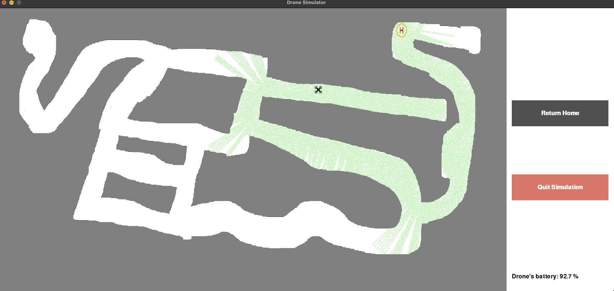
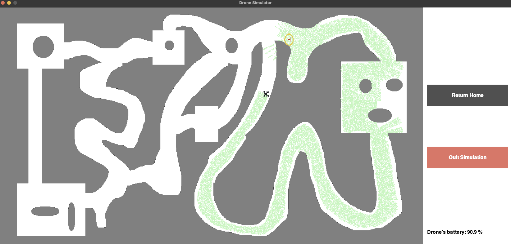
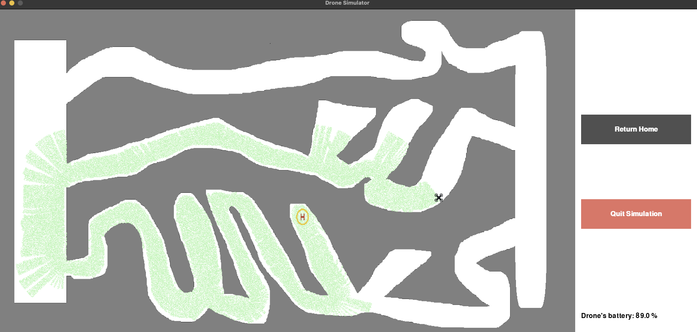

# Final Project in Autonomous Robotics course

## Authors: Tom Shabalin, Dor Harizi and Shai Moshe

## Overview
The primary objective of this project is to develop an effective solution for a small drone to navigate indoors without collisions. This project involves a fully autonomous 2D drone simulator designed to be as realistic as possible. It incorporates LIDAR sensors, a gyroscope, an optical flow sensor, and a speed sensor, with each sensor's readings including a slight amount of noise to enhance realism.

## Some examples from our test running






## What was added from the previous implementation
The previous implementation ([Drone Simulator](https://github.com/MightyArty/DroneSimulator)) was implemented in Java, and was not so accurate.\
The drone was hitting the walls very often, going into a loop while not discovering any new areas, and did not have the ability to return Home (starting point).
### The improvements
1. `Return Home ability`: when the drone battery sensor hits 50%, it return to the starting point while using the shortest path possible. In addition, we have implemented a simple Button, that by pressing it the Drone can also return to the starting point.
2. `New path finding`: the drone main aim now is to explore new areas, and try to not go back to already explored ares.
3. `Improved GUI`: the GUI is also improved a lot, making it more functional, more understandable and more user friendly.
4. `PID Controllers`: added 3 PID (Proportional-Integral-Derivative) controllers
    * Main controller
    * Forward controller
    * Narrow controller

    Each one of the controllers receving different calibration parameters to correctly navigate and detect walls in different areas such as tight corrdiros.

    Link to the Proportional Integral Derivative calculation formula:
    https://en.wikipedia.org/wiki/Proportional%E2%80%93integral%E2%80%93derivative_controller
5. `Sensors`: added 6 sensors to the Drone for each direction to correctly and efficiently detect obstacles on the wasy
    * Forward Distance Sensor
    * Forward-Right Distance Sensor
    * Forward-Left Distance Sensor
    * Back Distance Sensor
    * Right Distance Sensor
    * Left Distance Sensor

### Alogirthm that we used:
https://en.wikipedia.org/wiki/Digital_differential_analyzer_(graphics_algorithm)\
`DDA Algorithm`: The DDA algorithm is part of the line drawing algorithms in computer graphics. Using the DDA algorithm, we can generate the intermediate points along a straight line between two given endpoints. , we progress towards a downward direction. Finally, rounding off is necessary when calculating the new points.

The GUI was implemented using Pygame library.

## How to run
```bash
# Clone the repository
$ git clone "https://github.com/MightyArty/Autonomous_Robotics_Final"
# Enter the folder
$ cd Autonomous_Robotics_Final
# Install the required libraries
$ Run "pip install -r requirements.txt"
# After installing the libraries
$ Run "python main.py"
# A window with map selection will open, choose a map and have fun.
```